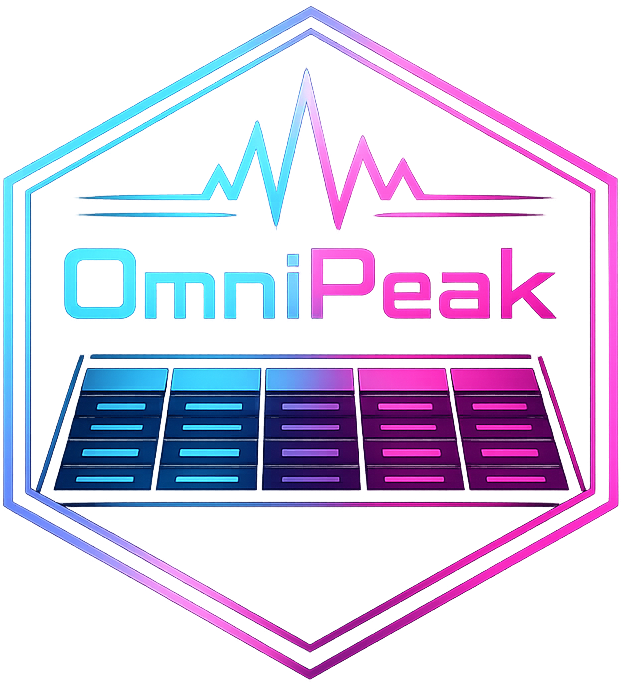

[](https://www.repostatus.org/#inactive)
[](https://cran.r-project.org/index.html)
[](https://choosealicense.com/licenses/gpl-3.0/)
# OmniPeak 

### Description :bookmark_tabs:
The [`Shiny App`](https://shiny.posit.co/) for reshaping metabolomics peak table: 
- Directly reads the output peak table from [`mzMine`](https://mzio.io/mzmine-news/), [`xcms`](https://www.bioconductor.org/packages/release/bioc/html/xcms.html), [`MS-DIAL`](https://systemsomicslab.github.io/compms/msdial/main.html), and Default format (see [examples of inputs](https://github.com/plyush1993/OmniPeak/tree/main/toy_examples))
- Prepares tidy table: features (peaks) as columns, samples as rows, with Label and other metadata columns. Exports in `.csv` or `.txt`
- Restores native data format
- Generates an R script for reading output tailored to your specific dataset

### Launch the App :rocket:
**Shiny deployment**<br>
[**`https://plyush1993.shinyapps.io/OmniPeak/`**](https://plyush1993.shinyapps.io/OmniPeak/) <br><br>
**Run locally**<br>
Install:
```r
if (!require("remotes", quietly = TRUE)) {
    install.packages("remotes")
}
remotes::install_github("plyush1993/OmniPeak", INSTALL_opts = "--no-multiarch")
```
or
```r
if (!requireNamespace("pak", quietly = TRUE)) install.packages("pak")
pak::pak("plyush1993/OmniPeak")
```
Run:
```r
OmniPeak::run_OmniPeak()
```
<br>

> [!IMPORTANT]
>The [App's script](https://github.com/plyush1993/omnipeak/blob/main/app.R) was compiled using [R version 4.1.2](https://cran.r-project.org/bin/windows/base/old/4.1.2/) 
<br>

### Contact :mailbox_with_mail:
Please send any comment, suggestion or question you may have to the author (Dr. Ivan Plyushchenko):  
<div> 
  <a href="mailto:plyushchenko.ivan@gmail.com"></a>
  <a href="https://github.com/plyush1993"></a>
  <a href="https://orcid.org/0000-0003-3883-4695"></a>
</div>
